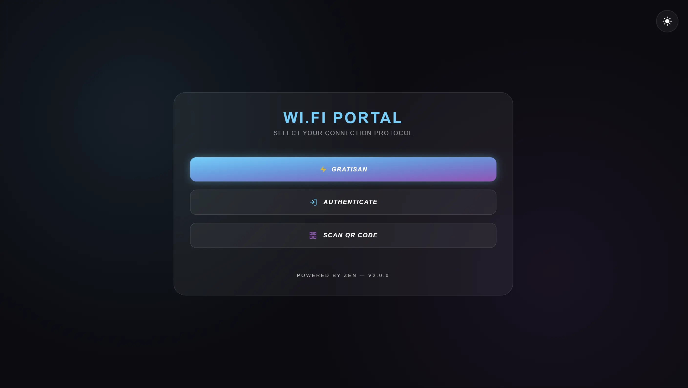
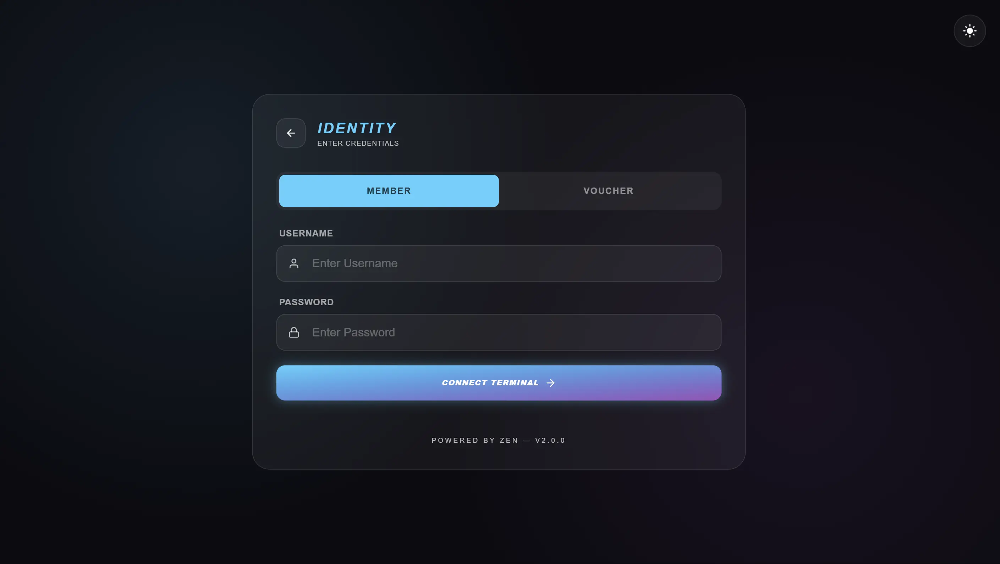
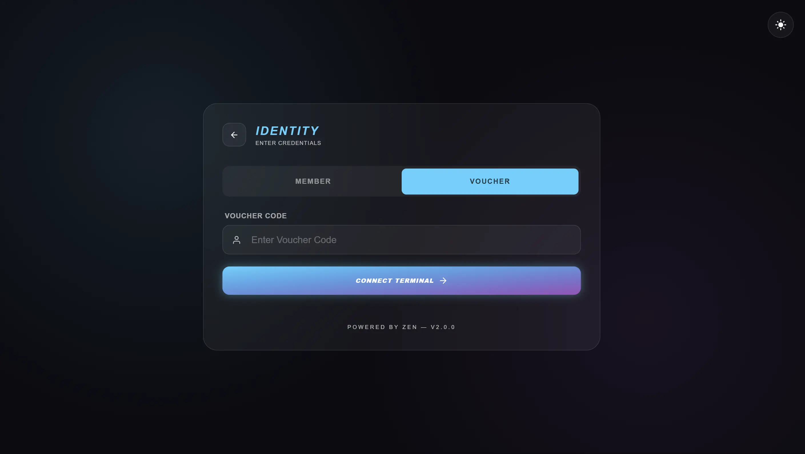
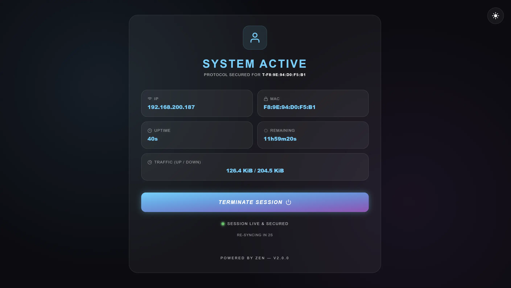
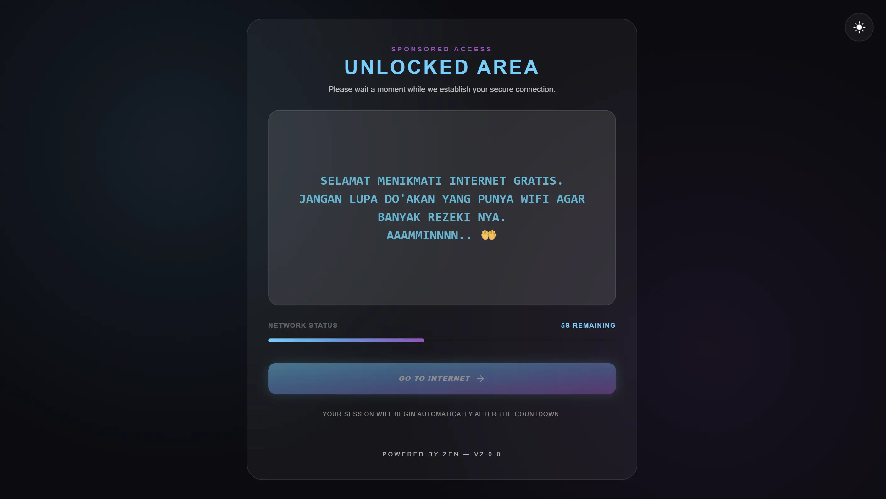
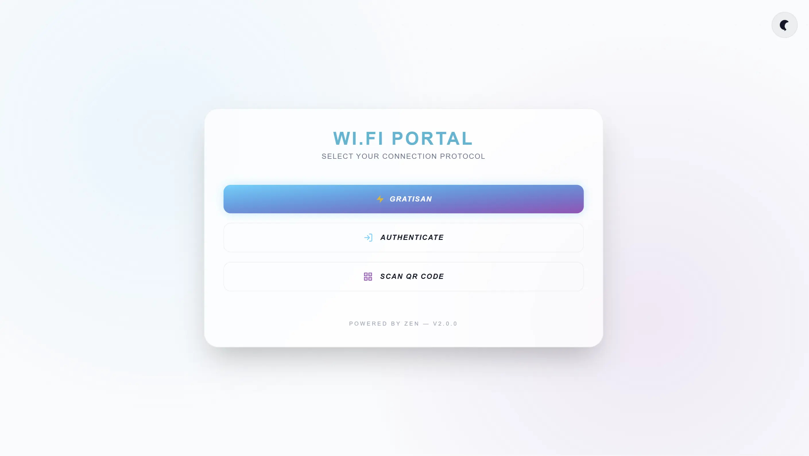
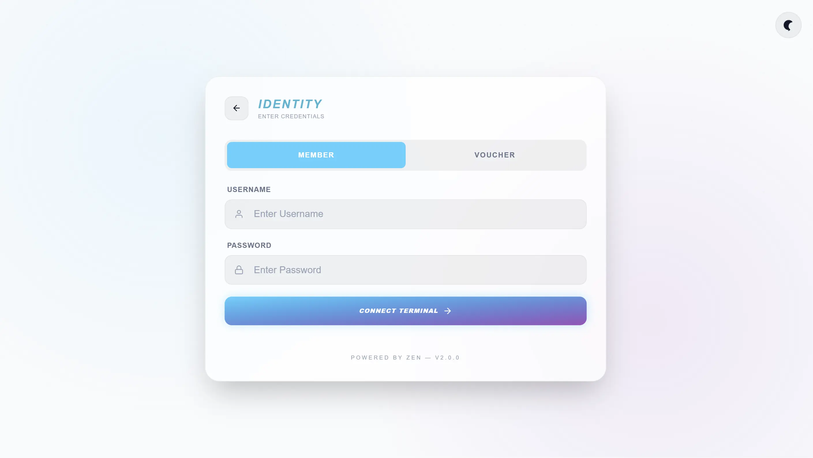
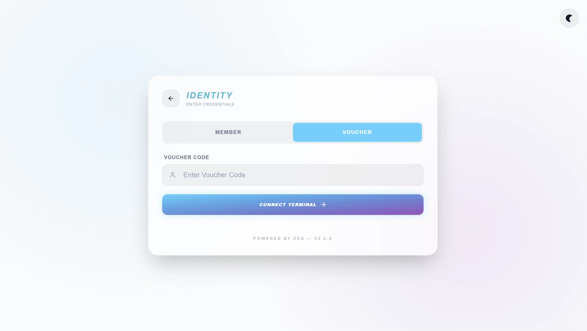
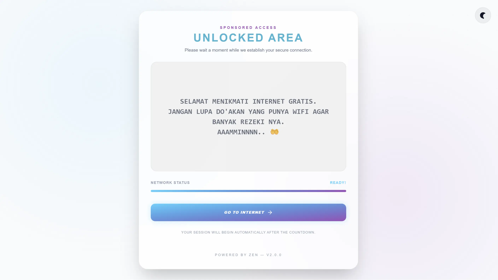
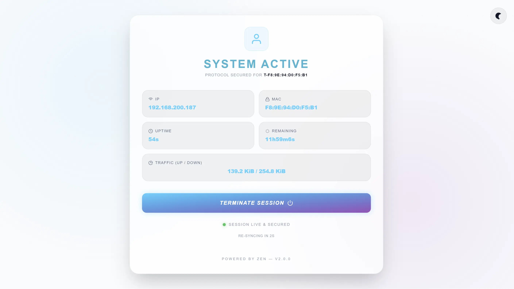

# Mikrotik Hotspot Template

A futuristic Mikrotik Hotspot template built using Tailwind CSS.

<h3 align="center">Screenshots</h3>

<table align="center">
  <tr>
    <td></td>
    <td></td>
    <td></td>
    <td></td>
    <td></td>
  </tr>
  <tr>
    <td></td>
    <td></td>
    <td></td>
    <td></td>
    <td></td>
  </tr>
</table>

---

### Requirement
- Node or Bun

### Setup dev

```bash
bun install
# or
npm install
```
### Start dev

```bash
bun dev 
# or
npm run dev
```

### Build

```bash
bun make
# or
npm run make
```
the result will be in the `results` folder. you can copy it to your mikrotik.
